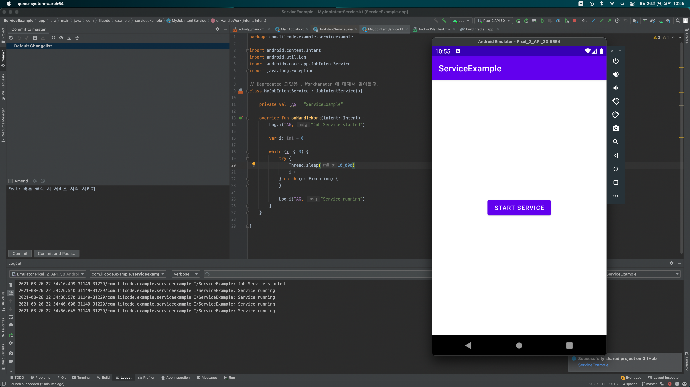
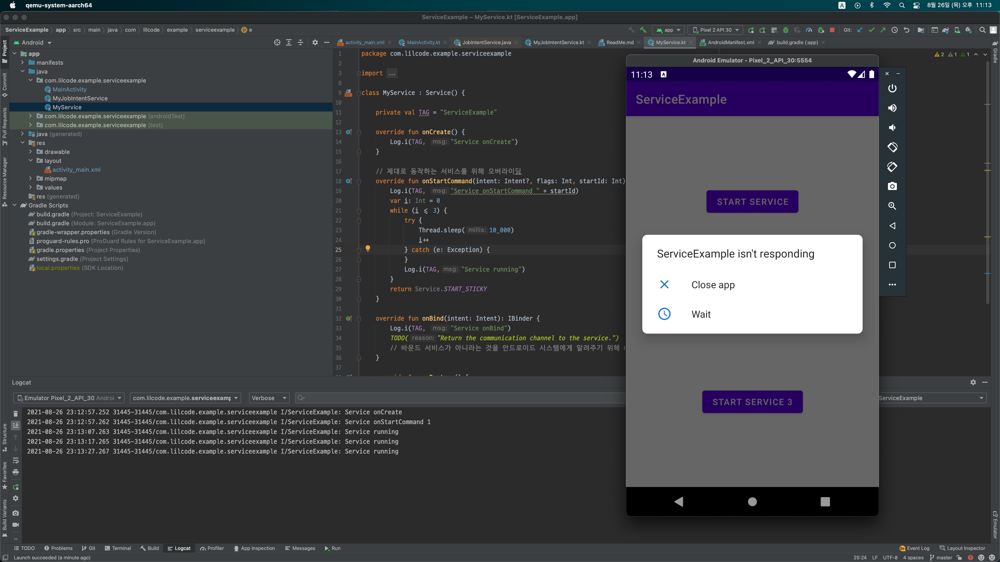
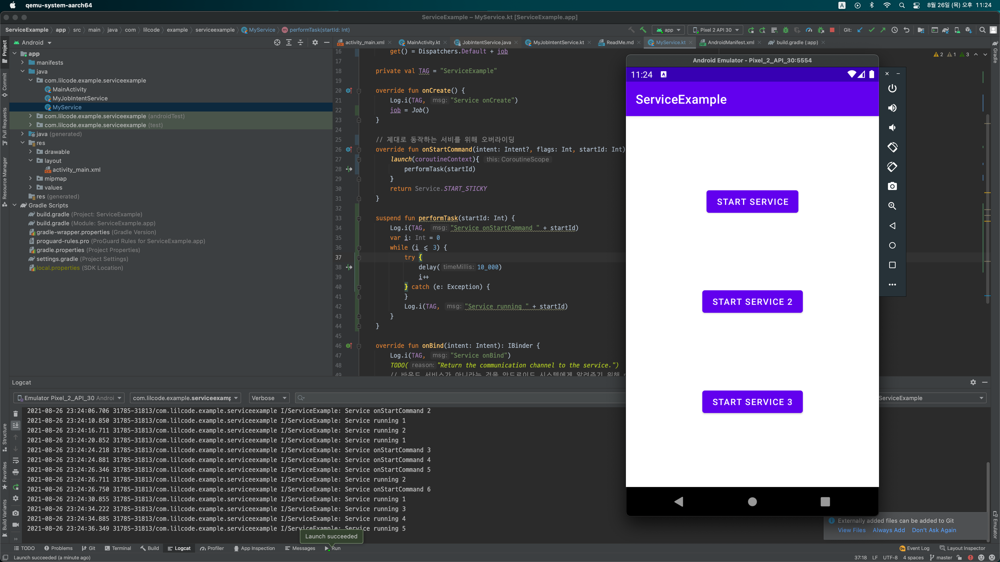

# Service Example - 1

## ~~JobIntentService 사용 해보기~~
- ~~JobIntentService 사용 해보기~~ (deprecated!) -> WorkManager 학습 예정
- 메인 스레드와 별도로 서비스 작업을 실행.
- 동기화 처리가 필요없는 경우.



## Service 클래스 사용 해보기

- 앱과 동일한 스레드를 사용해서 서비스를 실행해보고 왜 이것이 위험한지 실습
- 이후 새로운 스레드로 서비스를 생성하고 실행 해보기
- add-service-service



- 코루틴을 사용한 서비스 사용 개선
- 여러번 눌러서 여러 서비스를 동시에 실행한다!




```kotlin
package com.lilcode.example.serviceexample

import android.app.Service
import android.content.Intent
import android.os.IBinder
import android.util.Log
import kotlinx.coroutines.*
import java.lang.Exception
import kotlin.coroutines.CoroutineContext

class MyService : Service(), CoroutineScope {

    private lateinit var job: Job

    override val coroutineContext: CoroutineContext
        get() = Dispatchers.Default + job

    private val TAG = "ServiceExample"

    override fun onCreate() {
        Log.i(TAG, "Service onCreate")
        job = Job()
    }

    // 제대로 동작하는 서비를 위해 오버라이딩
    override fun onStartCommand(intent: Intent?, flags: Int, startId: Int): Int {
        launch(coroutineContext){
            performTask(startId)
        }
        return Service.START_STICKY
    }

    private suspend fun performTask(startId: Int) {
        Log.i(TAG, "Service onStartCommand " + startId)
        var i: Int = 0
        while (i <= 3) {
            try {
                delay(10_000)
                i++
            } catch (e: Exception) {
            }
            Log.i(TAG, "Service running " + startId)
        }
    }

    override fun onBind(intent: Intent): IBinder {
        Log.i(TAG, "Service onBind")
        TODO("Return the communication channel to the service.")
        // 바운드 서비스가 아니라는 것을 안드로이드 시스템에게 알려주기 위해 null 값을 반환.
    }

    override fun onDestroy() {
        Log.i(TAG, "Service onDestroy")
        super.onDestroy()
    }
}
```

- 한번 봐보기 : https://bb-library.tistory.com/109